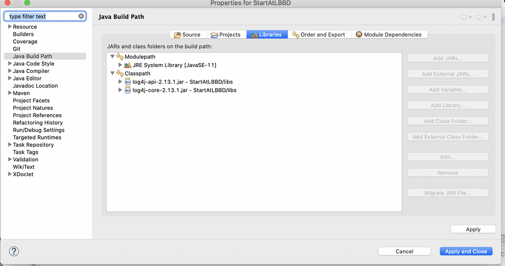

# Einbinden von Log4J 2 ins Projekt mit Eclipse #

Die Libraries, die verwendet werden, sind im Verzeichnis libs untergebracht. Sie werden im pom.xml referenziert. Damit auch Eclipse weiss, wo es die Libraries findet, musste ich sie noch in den Classpath des Projekts eintragen.

Project -> Properties -> Java Build Path -> Classpath und dann den Classpath markieren.

Danach wird der Button "Add Jars" aktiv. Damit kann man dann die beiden Libraries aus dem Lib-Ordner hinzufügen.

Danach kann via Rechtsklick auf das pom.xml -> Run as -> Maven install aufgerufen werden.

Auch Rechtsklick -> Run as -> Maven build sollte möglich sein. Sofern Du Klassen anpasst, werden manche Änderungen erst aktiv, wenn man das Projekt so neu gebuildet hat. Besonders dann, wenn Libraries rausgenommen oder hinzugefügt werden.<

Beim ersten Aufruf von Maven build kam bei mir noch ein Fenster, was einen Namen einfordert hat. Dort hat "Test" bei mir gereicht. Alle anderen Felder habe ich so belassen, wie sie waren.

Danach konnte ich die LearningLog4J Klasse als Java Application ausführen.
