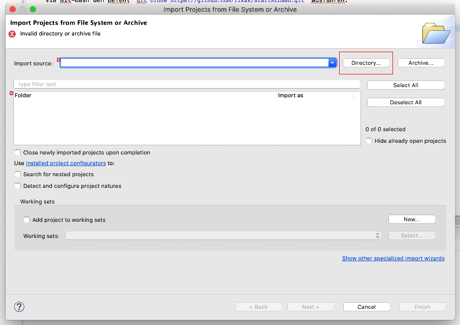
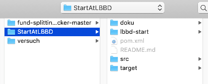

# Importieren des Projekts in Eclipse #

Vorbedingung:

Damit das Projekt importiert werden kann, muss es zunächst geclont werden. Falls noch nicht im Git-Kapitel ausgeführt. Dann jetzt via Git-Bash den Befehl `git clone https://github.com/IlkaK/StartAtLBBD.git` ausführen.

1. Öffnen von Eclipse, File, Open Projects from File System

2. Wähle Directory aus: 

3. Markiere den Ordner `StartAtLBBD`, der beim Klonen erstellt wurde. 

4. Wenn das geklappt hat, ist das Projekt importiert. 

Wenn Du möchtest, kannst Du auf dem pom.xml via Rechtsklick `run as` und dann `Maven install` ausführen. 
Ist aber jetzt noch nicht zwingend nötig.