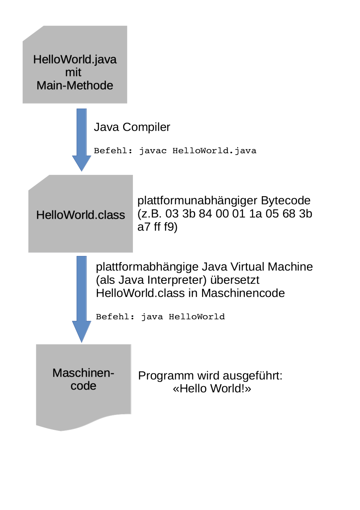

# Hello World! #

Im ersten Kapitel beschreibt Michael Kofler sehr gut die einzelnen gängigen Begriffe und den Ablauf von Java-Programmen. Was mir ein wenig fehlt, ist ein übergreifendes Bild, welches den Zusammenhang aller Begriffe beschreibt. Daher habe ich selber noch eine Grafik als Ergänzung dazu gemacht. Die folgende Grafik baut auf dem Kapitel 1.6 (Seite 34 ff., "Hello World mit javac und java manuell übersetzen") auf. Dort wird beschrieben, wie via Java-Compiler die Klasse in Bytecode (eine class-Datei) übersetzt. Danach ist sie mit einem Java-Interpreter ausführbar. 

Als Java-Interpreter wird die Java Virtual Machine verwendet. Bei manchen Programmiersprachen wird das Kompilieren und Interpretieren von Code zusammengefasst, bei Java nicht. Java hat diesen expliziten Schritt zum Kompilieren davor, der die Datei vom .java in .class umwandelt. Beim Interpretieren wird dann die .class-Datei zur Laufzeit (also nachdem das Programm gestartet wurde) in Maschinencode umgewandelt und ausgeführt. In dem Wikipedia-Artikel [Interpreter, Unterkapitel Verwendung, Unterunterkapitel Programmierung](https://de.wikipedia.org/wiki/Interpreter)
wird darauf eingegangen, welche Kombinationen es gibt. Java ist ein Compiler-Interpreter.

