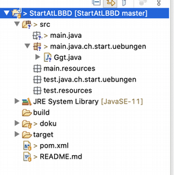
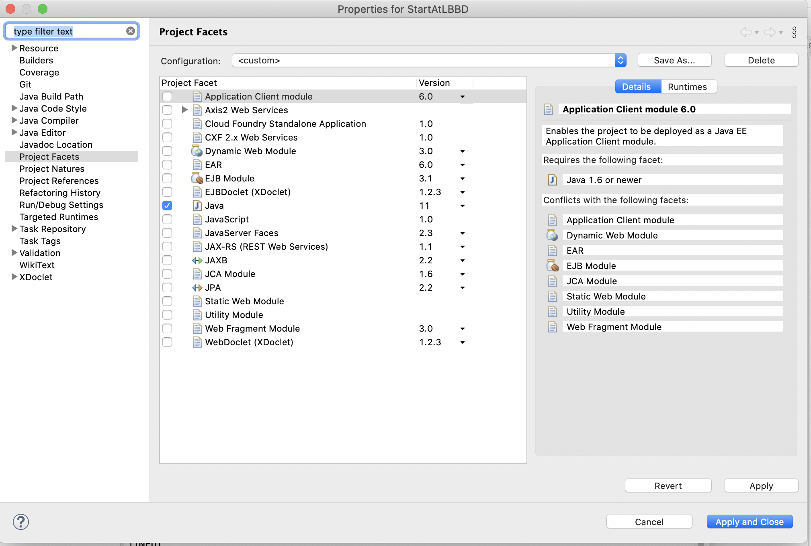
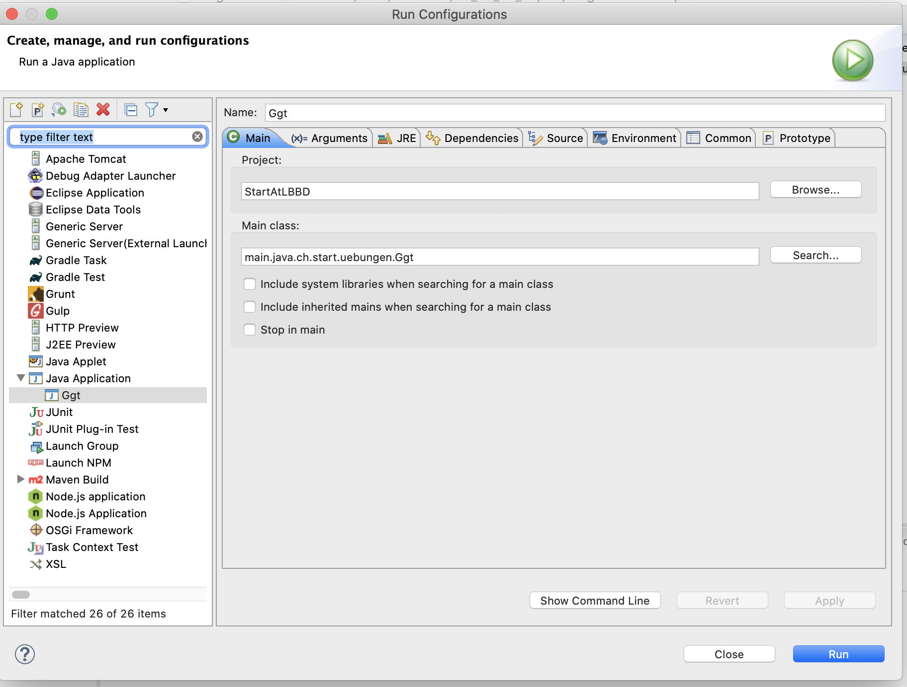
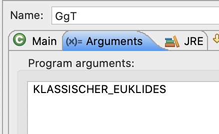

# Übung zu Kapitel 2 bis 4 #

In der folgenden Übung habe ich überlegt, dass wir eine grössere Aufgabe machen, die vor allem das Kapitel 3 ("Variablenverwaltung") und Kapitel 4 ("Operatoren") umfasst. Auch das Kapitel 2 ("Java-Crashkurs") kannst Du vorher lesen, aber es hat nur indirekt mit der Übung zu tun. So wie Michael Kofler am Anfang zu Kapitel 2 beschreibt, gibt Dir der "Java-Crashkurs" einen kurzen Überblick über alles, aber man braucht noch nicht alles verstehen, bzw. kann das Kapitel auch später noch mal lesen.

Mir geht es in dieser Übung darum, dass wir uns mit Methoden, Variablen, deren Wertezuweisungen und Operatoren beschäftigen. Also ungefähr das, was in Kapitel 3 und Kapitel 4 erklärt wird. 

## Vorbereitungen ## 

Ich habe eine Klasse GgT.java angelegt, die Du entsprechend erweitern kannst. 
Damit sie läuft, musste ich noch ein paar Anpassungen des Projektes in Eclipse machen. Vielleicht braucht es das bei Dir auch.

Rechtsklick auf das Projekt "StartAtLBBD" und dann "Properties"

In "Project Facets", Configuration "Custom" einstellen und Java anklicken. Dann sollte das Projekt ungefähr so aussehen, wie auf dem oberesten Bild.

Damit GgT läuft, Rechtsklick auf die Klasse und "Run as" "Java Application". Dann unter dem Menüpunkt "Run" "Run Configurations" einstellen.

Dort in das Tab "Arguments" wechseln und eines der Werte aus dem Enum "GgTMethod" eingeben.

Ich hoffe, das klappt soweit. 

## Übungsbeschreibung ##

So jetzt zur Übung an sich. Ich habe eine Java-Klasse (GgT.java) angelegt und einen Enum (GgTMethod.java). In GgT ist die Main-Methode, die ausgeführt wird. Die Übung an sich ist nicht schwer, es geht darum, den grössten gemeinsamen Teiler von zwei Zahlen auszurechnen. [Wikidia-Link zum GgT](https://de.wikipedia.org/wiki/Gr%C3%B6%C3%9Fter_gemeinsamer_Teiler) 

Es gibt mehrere Möglichkeiten, den auszurechnen. Zwei Möglichkeiten davon sin der klassiche euklidische Algorithmus und dann noch der moderne euklidischen Algorithmus. 

Beim klassischen euklidischen Algorithmus wird die kleinere Zahl jeweils von der grösseren abezogen. Die Zahl, die am Ende übrig bleibt, ist der grösste gemeinsame Teiler beider Zahlen. 

Z.B. 42 und 36:

42 - 36 = 6

36 - 6 = 30

30 - 6 = 24

24 - 6 = 18

18 - 6 = 12

12 - 6 = 6

Oder z.B. 40 und 13

40-13 = 27

27-13 = 14

14-13 = 1

Beim modernen euklidischen Algorithmus gibt es eine Division mit Rest. Die eine Zahl wird durch die andere dividiert und dann wird der Rest genommen und wieder mit dem weiterdividiert, bis es keinen Rest mehr gibt.

Bei 42 und 36:

42 div 36 = 6

36 div 6  = 0

Bei 40 und 13:

40 div 13 = 27

27 div 13 = 14

14 div 13 = 1

In der Übung geht es jetzt darum, dass Du beide Möglichkeiten implementierst. Anhand des ersten Arguments, welches der Methode übergeben wird, wird unterschieden, ob der klassische oder der moderne euklidische Algorithmus verwendet wird. Die beiden Zahlen, für die der GgT berechnet werden soll, sollen als weitere Input-Argumente in die Main-Methode kommen. Unter Run Configurations kannst Du bei den Argumenten neben KLASSISCHER_EUKLIDES mit Leerschlag getrennt weitere Argumente angeben. Die tauchen dann in dem args-Array der Main-Methode auf. Ich habe noch auskommentierten Code, mit dem die Eingangsliste durchgeloopt werden kann. Vielleicht hilft der Dir am Anfang weiter.

Wichtig bei der Übung ist mir, dass Du eingängige Variablen- und Methodennamen wählst und den Code kommentierst, damit ich nachvollziehen kann, was Du Dir ungefähr überlegt hast. Wir können uns später noch mit Debugging beschäftigen, vielleicht hilft Dir jetzt am Anfang noch System.out.println. 

Wenn das alles zu langweilig ist, kannst Du einen weiteren Algorithmus einbinden, den [steinschen Algorithmus](https://de.wikipedia.org/wiki/Steinscher_Algorithmus).
