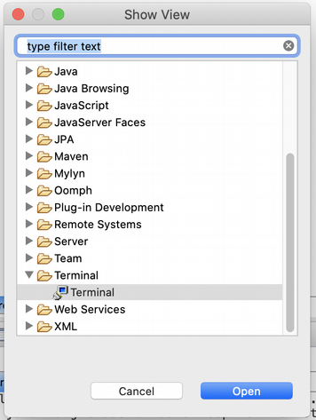
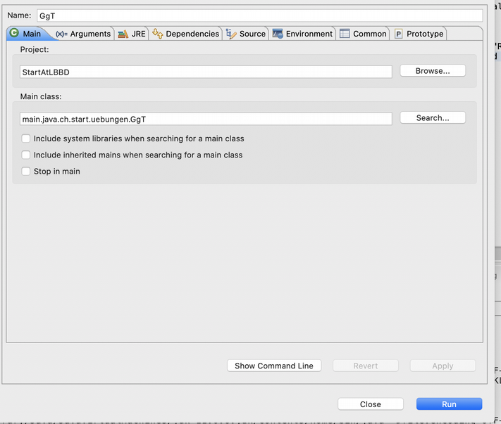
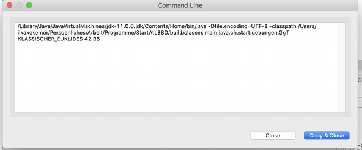
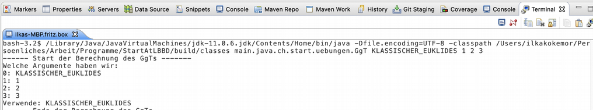

# Ausführen eines Java-Programms mit variablen Argumenten in Eclipse #

Um die GgT-Klasse mit variablen Argumenten auszuführen, bietet uns Eclipse die Möglichkeit Java im Terminal auszuführen.

Im Terminal kannst Du den String zum Ausführen eingeben, der immer dann ausgeführt wird, wenn Eclipse -> "Run" ausgeführt wird.
Um den richtigen String zu bekommen, gehst Du unter "Run Configurations" dort auf den Button "Show Command Line"

Der String, dort angezeigt wird, kann dann einfach ins Terminal kopiert werden.

Für den String können dann jeweils die Argumente angepasst werden.

