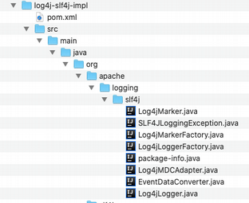
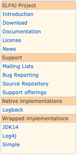

# Logging mit Slf4J #

Bei Slf4J haben wir es mit einer Ansammlung von konkreten Klassen und Interfaces zu tun. Slf4J steht für Simple Logging Facade. Im [Slf4J user manual](http://www.slf4j.org/manual.html) wird beschrieben, dass  Slf4J eine Facade oder Abstraktion ist. Konkret bedeutet das, dass man Slf4J selber direkt nicht verwenden kann, sondern dass Slf4J beschreibt, wie eine Sammlung aus Klassen aussehen bzw. implementiert sein soll. Zusätzlich bietet es auch schon gewisse konkrete Klassen an, die dann bei dem Ausprogrammieren der Interfaces verwendet werden können.

Wir haben mit Log4J 2 schon eine Ableitung von Slf4J kennengelernt. Wir haben Log4J 2 direkt verwendet, aber es wäre auch als Implementation von Slf4J möglich.
[Slf4J für Log4J 2](https://logging.apache.org/log4j/2.x/log4j-slf4j-impl/index.html)


## Slf4J als Abstraktion mit Interfaces und konkreten Klassen ##

Eine Abstraktion muss nicht aus abstrakten Klassen bestehen. Bei Slf4J habe ich keine abstrakten Klassen gefunden, sondern nur Interfaces und konkrete Klassen, d.h. ausprogrammierte Klassen.
Den Begriff Abstraktion finde ich daher sehr verwirrend.

Wenn man Slf4J mit einem selber geschriebenen Logging-Mechanisumus verwenden möchte, dann muss man die Interfaces ausprogrammieren. Hier sehen wir das [Package Summary](http://www.slf4j.org/apidocs/org/slf4j/package-summary.html) von Slf4J. Schauen wir uns an, was Log4J 2 damit gemacht hat.

Was macht Log4J 2 z.B. beim [Logger von Slf4J](http://www.slf4j.org/apidocs/org/slf4j/Logger.html). Er wird beschrieben als Einstiegspunkt zum Erstellen von Log-Messages.
Es muss also in Log4J 2 eine Klasse geben, die dieses Interface implementiert. Unter diesem [Link](https://www.apache.org/dyn/closer.lua/logging/log4j/2.13.2/apache-log4j-2.13.2-src.zip) kann man den Source Code vom Log4J 2 runterladen, der auch die Einbettung in Slf4J enthält.



Ich würde die Implementation des Loggers rein namenstechnisch im Log4JLogger erwarten. Aber statt das erwartete Logger-Interface finden wir bei Log4JLogger den LocationAwareLogger von Slf4J.Spi. Der [LogactionAwareLogger]((http://www.slf4j.org/apidocs/org/slf4j/spi/LocationAwareLogger.html) ist aber wieder eine Ableitung vom Logger und selber auch wieder ein Interface. Es ist also ein wenig komplizierter, aber im Grunde genommen, enthält Log4JLogger einfach mehr Methoden, als er für den Logger impelementieren müsste (also auch die für LocationAwareLogger). Der Log4JLogger wird damit aber alle Methoden, die das Interface Logger vorschreibt implementieren müssen. Nehmen wir die Methode ``getName``. Laut der Interface-Beschreibung vom Logger soll diese Methode den Namen der Logger Instance zurückliefern ("Return the name of this Logger instance."). Genau das finden wir im Log4JLogger wieder. 

```
    @Override
    public String getName() {
        return name;
    }
```

Eigentlich sehr simpel. Auch die restlichen Methoden im Log4JLogger scheinen nicht sehr komplex zu sein.


## Logging mit Logback ##

Logback hat im Gegensatz zu Log4J 2 Slf4J automatisch integriert. D.h. wir können Logback gar nicht ohne Slf4J verwenden. Logback enthält Slf4J als "native Implementation".



Wenn Du Dir die Klasse LearningLogback.java anschaust, siehst Du, dass hier direkt mit den Interfaces von Slf4J gearbeitet wird und Logback gar nicht in den Imports auftaucht. 
Den Code von Logback finden wir auf [Github](https://github.com/qos-ch/logback) wieder. Die Implementation vom Logger ist [hier](https://github.com/qos-ch/logback/blob/master/logback-classic/src/main/java/ch/qos/logback/classic/Logger.java). Auch hier finden wir die ``getName`` Methode wieder. Sie sieht der von Log4J 2 sehr sehr ähnlich.

```
 public String getName() {
        return name;
    }
```

## Übung zum Verlgeich von Logback und Log4J 2 ## 

Ich habe dem Projekt weitere Bibliotheken zu Logback und Slf4J hinzugefügt. Ggf. musst Du die ebenfalls bei Dir im Classpath von Eclipe hinzugefügen (wie in 

Was machen Logback und Log4J 2 jetzt anders bezüglich Slf4J?
Vielleicht liegt der Unterschied eher im Detail.

Ich habe eine einfaches Logging in log4j2.xml konfiguriert (vorsicht, beim Rebase wird Deine log4j2.xml überschrieben).
Ein ähnliches Logging habe ich in der Konfiguration von Logback aufgesetzt: logback.xml.

Aber die Ausgaben mittels LearningLog4J.java und LearningLogback4.java sehen dennoch leicht unterschiedlich aus:

```
Log4J2: 22:02:40.027 518  [main] INFO  main.java.ch.start.uebungen.LearningLog4J - Log4J2 application.

Logback: 22:11:39.618 161  [main] INFO  m.j.c.start.uebungen.LearningLogback - Logback application.
```

Die Aufgabe ist also, herauzufinden, welche Pattern bietet Logback an und welche Log4J 2.

[Pattern in Log4J 2](https://logging.apache.org/log4j/2.x/manual/layouts.html#PatternLayout)
[Pattern in Logback]((http://logback.qos.ch/manual/layouts.html)

Wenn man nur ein grosse Logfile und viele Probleme mit der Applikation hat, ist man häufig froh über jede zusätzliche Information, die man bekommen kann.
Gibt es vielleicht Informationen in den Pattern, die das eine Framework anbietet das andere aber nicht?


## Kleiner Exkurs zu abstrakten Klassen und Interfaces ##

Abstrakte Klassen werden von Michael Kofler auf Seite 250 beschrieben. Die Interfaces haben als eigenes Kapitel (Schnittstellen) ab Seite 264 einen grössen Abschnitt bekommen.

Abstrakte Klassen und Interfaces sind einander aber sehr ähnlich. Eine abstrakte Klasse kann rein abstrakte Methoden beinhalten. Wenn alle Methoden abstrakt sind, bedeutet das, wer von der abstrakten Klasse ableitet, muss alle dort drin definierten Methoden ausprogrammieren. Bei Interfaces ist es das Gleiche. Interfaces werden in konkreten Klassen implementiert. Alle im Interface definierten Methoden müssen in der konkreten Klasse ausprogrammiert werden. Eine abstrakte Klasse kann aber auch nicht abstrakte Methoden beinhalten, also bereits ausprogrammierte. Das ist bei Interfaces nicht möglich. Dort drin sind niemals ausprogrammierte Methoden.

Abstrakte Klassen und Interfaces kann man nie direkt initialisieren. Es kann also kein Objekt von einer abstrakten Klasse oder einem Interface erzeugt werden.

Auf Seite 269 geht Michael Kofler noch auf einen wesentlichen Unterschied von abstrakten Klassen gegenüber Interfaces ein (Abstrakte Klassen versus Schnittstellen).


