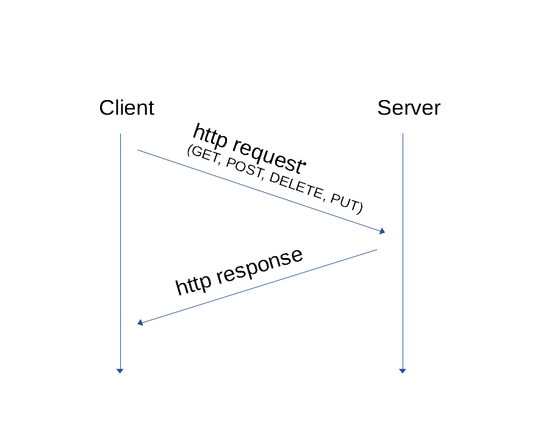

# HTTP #

Der http request enthält einen Header (inklusive der URL) und häufig einen Body.

- GET: Header, aber kein Body
- DELETE: Header, aber kein Body

- POST Header und Body
- PUT: Header und Body

Der http response enthält eine Status-Line, einen oder mehrere Header und einen Body.

## Warum brauchen wir in REST alle verschiedenen Methoden: GET, POST, DELETE, PUT? ##

REST setzt auf dem http API auf.

"REST is a methodology for meaningful access of data. When you see a request in REST, it should immediately be apparant what is happening with the data."

"RESTful applications maximize the use of the pre-existing, well-defined interface and other built-in capabilities provided by the chosen network protocol, and minimize the addition of new application-specific features on top of it."

[Quelle](https://stackoverflow.com/questions/4573305/rest-api-why-use-put-delete-post-get)